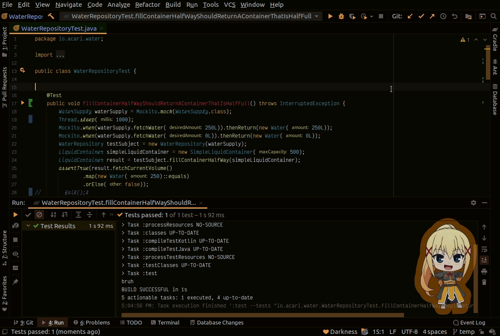
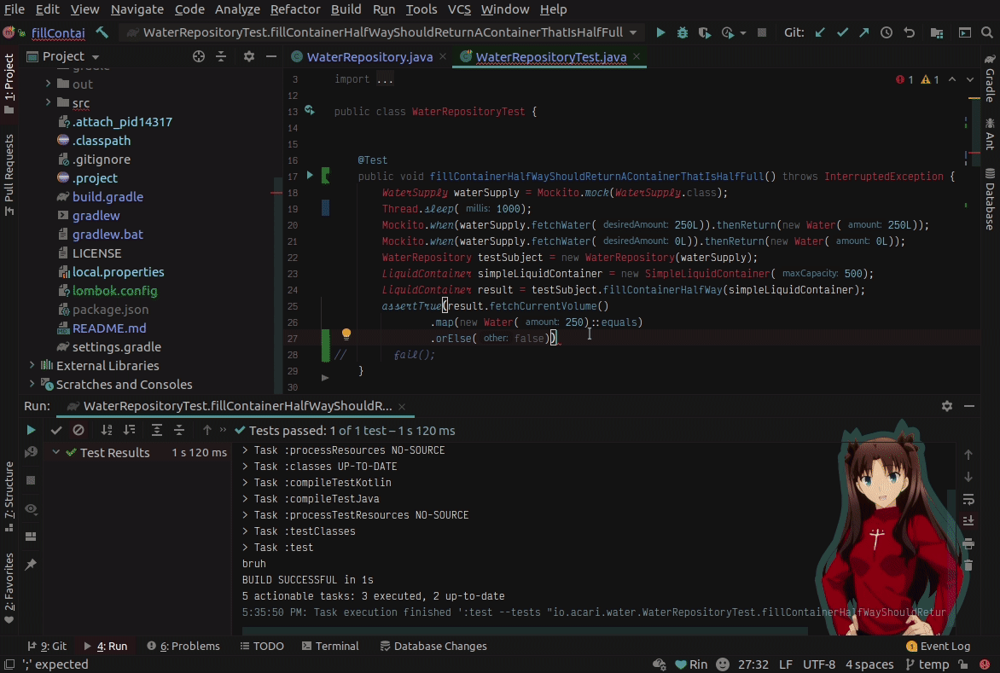
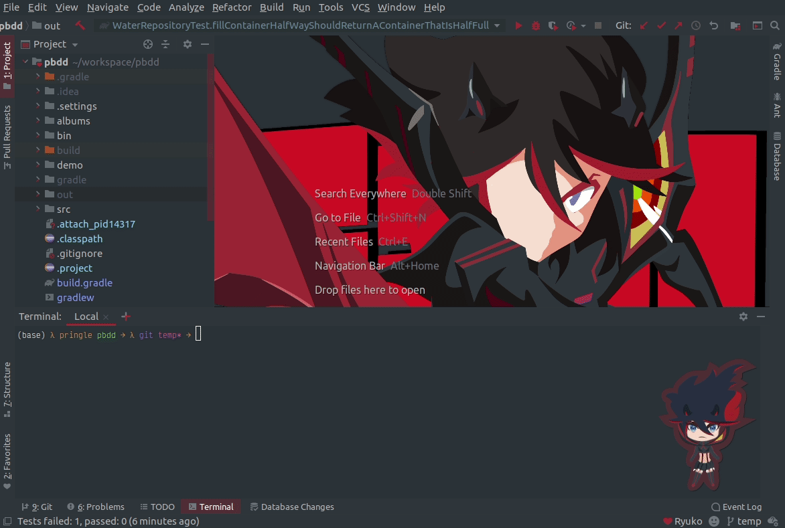
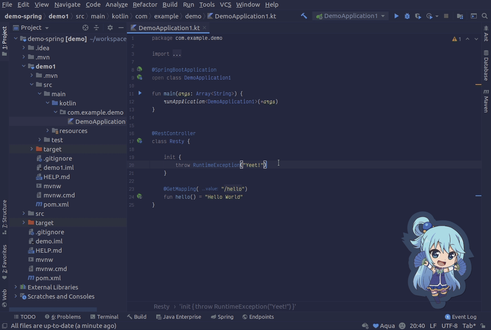
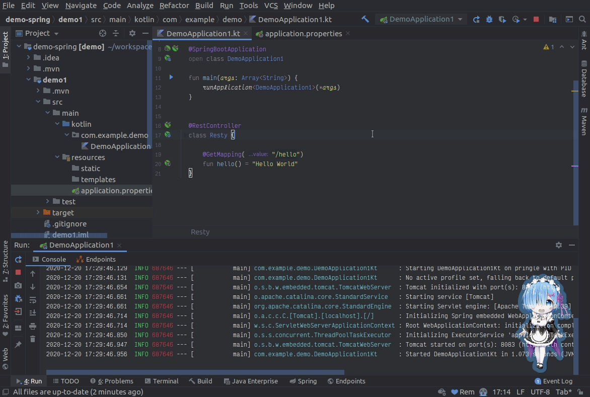
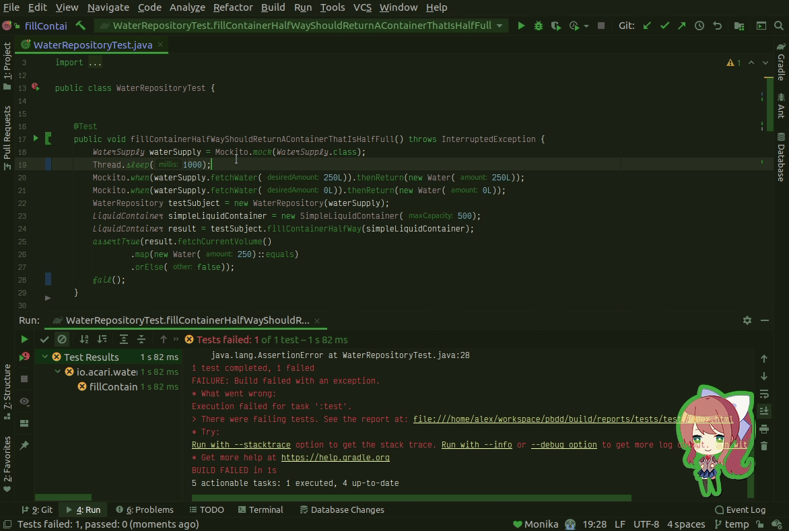
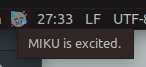

    </img>

# AMII (Anime Meme IDE Integration)

<!-- Plugin description -->
Give your IDE more personality and have <emphasis>more</emphasis> fun programming with the **A**nime **M**eme **I**DE **I**ntegration! (AMII)  
Upon installation, our Meme Inference Knowledge Unit (or MIKU for short)
will begin interact with you as you build code.
MIKU knows when your programs fail to run or tests pass/fail.
Your new companion has the ability to react to these events.
Which will most likely take the form of an anime meme of your: waifu, husbando, and/or favorite character(s)!  

<!-- Plugin description end -->

## Installation

- Using IDE built-in plugin system:

  <kbd>Preferences</kbd> > <kbd>Plugins</kbd> > <kbd>Marketplace</kbd> > <kbd>Search for "Anime Memes"</kbd> >
  <kbd>Install Plugin</kbd>

- Manually:

  Download the [latest release](https://github.com/Unthrottled/AMII/releases/latest) and install it manually using
  <kbd>Preferences</kbd> > <kbd>Plugins</kbd> > <kbd>⚙️</kbd> > <kbd>Install plugin from disk...</kbd>

---

# Documentation

- [Features](#features)
  - [Interactions](#interactions)
    - [Startup Greeting](#startup-greeting)
    - [Test Results](#test-results)
    - [Build Tasks](#build-tasks)
    - [Waiting](#waiting)
    - [Exit Codes](#exit-codes)
    - [Logs](#logs)
    - [On-Demand](#on-demand)
  - [Personality](#personality)
    - [Frustration](#frustration)
    - [Smug](#smug)
    - [Status](#status)
  - [Minimal Mode](#minimal-mode)
  - [Offline Mode](#offline-mode)
- [Configuration](#configuration)
  - [Sound](#sound)
  - [Content](#content)
  - [Display](#display)
  - [Asset Sync](#asset-sync)
    - [Asset View](#asset-view)
- [Extras](#extras)
  - [The Doki Theme](#the-doki-theme)
  - [Waifu Motivator](#the-doki-theme)
  - [Release Channel](#want-amii-updates-sooner)
- [Attributions](#attributions)
---
# Features

Here is a comprehensive list of all the current functionality that AMII has to offer.

## Interactions

This is the proverbial meat and potatoes of the plugin.
You will have choicest of anime memes delivered right to your IDE as you program to your heart's content.

**MIKU**

As mention previously, our Meme Inference Knowledge Unit (or MIKU for short)
has the ability interact with you as you build code.
MIKU's preferred method of communication is Anime Memes.

If you are wondering what things you can do to cause MIKU give you memes, well just look below!

_All events are configurable to be enabled/disabled, see [configuration](#configuration) for more details_

### Startup Greeting

Just opening up a project in your IDE is cause for celebration.
Generally, MIKU is excited to see you again.
It gets dark when you are gone, so stick around a bit!

> Note: All waiting notifications are set to the `timed` dismissal option.
> See the [dismissal](#dismissal) section for more details

### Test Results

Tests pass and tests fail, that's just a fact of life.
You know what's better than red x's and green check marks?

> Anime Memes

**Test Pass**

**Test Failures**

### Build Tasks

This is an IDE, right? Well, that means you can build code right from your editor.
It just so happens, that builds happen to fail from time to time.
You did put in that semicolon, right?

Well MIKU knows when your builds fail too, so expect a response as well.

**Build Pass**

When you get your marbles all back,
the next time you build successfully (after a build failure) MIKU will give you a pat on the back.

### Waiting

What do you mean you don't code all the time?
You mean that there are periods of time when you aren't using your IDE?

Well MIKU gets lonely, or a bit bored when you are gone.

> Note:
> - All waiting notifications are set to the `focus loss` dismissal option.
> See the [dismissal](#dismissal) section for more details.
> - Notifications by default are set to center,
> but can be configured in the [settings](#configuration).

### Exit Codes

So you got your code to build and deploy.
However, the program has a catastrophic error, which caused your poor application to terminate with a sad exit code.

As you probably guessed by now, MIKU is always watching, and has the ability to reply to your mistakes.

#### Negative Exit Code Reactions

Really, anything that exits with a non-zero value means that your program died unexpectedly.
So rather than having to supply an exhaustive list of exit codes, MIKU will just react negativly to any code that is either:
__Ignored__ or __Positive__.

**Ignored Exit Codes**

Programs that exit with:

  - **0**: Exited without issue
  - **130**: You terminated the proces (e.g. pressed the stop button)

are part of the default allowed exit codes, MIKU will not react negatively to these (but can if you want to).

#### Positive Exit Code Reactions

If you want a pat on the back when your program terminates correctly, your domestic virtual servant can be configured to do that as well.

### Silence Breaker

So you've been working diligently building your code, but not using any features of your IDE.
Such as building, testing, or running your project.
Well MIKU likes to remind you every so often that they exist.

You can specify how long you can go without seeing a meme.
After that, MIKU will give you one!

### Logs

Do you work on a project that takes a billion years for the application to start?
Good news! Your days of staring at your logs are over.

You can ask MIKU nicely to watch the logs for you.
Expect a notification whenever your phrase appears in your logged output!

### On-Demand

`Tools | AMII Options | Show random Ani-Meme`

I suppose if you are bored, or just want to show off your Anime Memes, you have the ability to get memes on demand.

## Personality

Don't get me wrong, having anime memes displayed in my IDE is awesome, but you know what's better?
Having custom tailored reactions, almost as if the memes displayed where hand-picked just for you!

As it just so happens, MIKU has various installed personality cores which enables such functionality.

### Frustration

MIKU is a fairly moody state machine and has many reactions to various events such as:
- Waiting for you to come back when you are away for some time
- Being really happy when your test pass.
- Becoming upset when your builds break and tests fail.

Thanks to advancements in technology, MIKU now also has the ability to feel your frustration when **things aren't working, WHY ARE THEY NOT WORKING!!**.
MIKU figures its good to inject a little humor into the mix and show you that they are frustrated as well.

**Frustration**

As a bonus, they also have the capability from evolving from being frustrated to full-blown rage.
This only happens when you have been triggering negative events in the frustration state for a given period.

**Rage**

Not every person wants their companion to get frustrated.
So you have the ability to disable this part of their personality,
by preventing them from ever being frustrated in the first place! 😄

**Take a Chill Pill!**

`Tools | AMII Options | Relax MIKU`

Have you accidentally upset MIKU? I know I have (coding is hard).
Well thankfully there is a `Relax MIKU` action that works as described.
This will reset the personality core's state so that you can continue to mess up as you please.

In addition, MIKU's frustration will also cool-down over time without the need for your intervention.

### Smug

Have you ever been in a rut where anything that you do just winds up failing?
Remember that feeling of finally fixing the issue?

Well when you finally get all your ducks in a row, you and MIKU may feel a bit smug.

For instance, if your test fails to run, the next time your tests pass, you have a chance of getting a _smug_ reaction.

### Boredom

The longer that you are away from your IDE, the more MIKU get bored.

They will start of waiting patiently for your return.
However, as time passes, you'll see that they can't entertain themselves forever.

Don't be surprised if you come back, and they are sleeping!

### Status

Ever want to know how MIKU is feeling at the moment?
They have the ability to display their current emotional state in your status bar.

## Minimal Mode

MIKU can be pretty chatty some times, especially if you are trying to figure out how to get your  integration test to work.
With `Minimal Mode` you have the ability to tell MIKU to only react to events that are different.
So when your tests fail a bunch of times, you will only see one failure reaction.
However, whenever you break your build or your tests pass, you'll get a notification then.

## Offline Mode

If you ever find yourself coding without any internet, don't worry friend, you can take MIKU with you.
All interactions that you have seen so far have been stored in a safe place on your computer, just for such an occasion!

# Configuration

`Tools | AMII Options | Show AMII's Settings`

Any way you want it, that's the way you need it!
AMII has a lot of customization that allows you to tailor the experience to your preferences.

## Sound

Haven't you heard? Well if you haven't, some of your interactions with MIKU may involve a related sound clip.

Not everybody wants to have their music interrupted as they are coding, so you can turn off all sound.
You even have the ability to turn the volume up and down as well!

## Content

**Preferred Gender**

We all have our own likes and dislikes (waifus, husbandos, giant robots, etc), well MIKU has the strokes for different folks.
This section will only show memes that contain **any** of the preferred gender.

**Preferred Characters**

Only want to see content with your main squeeze?
Well you can nicely ask MIKU to only show images of your preferred character.
However, your favorite character may **not** be in an asset that MIKU can use to express their feelings.
Rather than getting nothing, you'll get another random image that matches your other preferences!

**Blacklisted Characters**

You don't like the same things I like?? The nerve, how dare you!

Just kidding! 😃

I kind of figured that may happen, so I also added a `Character Blacklist`.
Which prevents _any_ content containing the selected characters from showing up!

**Note**: the **blacklist** takes preference over **preferences**.
So if there is content with blacklisted characters and preferred characters,
well then you don't get that content shown to you.

## Display

MIKU has to put your memes somewhere on your screen.
So here's how you can request to have your memes work the way you want them too.

**Position**

Each block represents a section where you want your meme to be anchored on your IDE's screen.

### Dismissal

Memes have to come and go, if they didn't exit then, it would be a bit hard to do any work.
Here's what each mode does.

**Timed**

So MIKU wants each meme to cycle at least once.
Some memes have a longer duration than others.
Here you can specify the minimum amount of time you want each meme to appear on the screen.

> **Tip**: If you want your `timed` meme to hang around for longer, just click on the meme!
> That will convert the dismissal mode to `focus loss`.
> Also handy for making long memes disappear sooner!

**Focus Loss**

Rather than letting MIKU decide on your meme duration, put yourself into control.
Memes created with the focus loss dismissal option will only disappear when you start coding or click outside the meme.

Because the meme's disappear when you are working, sometimes you can accidentally dismiss your meme.
So each meme is given a configurable duration where they are invulnerable to dismissal.
Which should buy you enough time to stop and enjoy it!

## Asset Sync

`Tools | AMII Options | Syncronize Assets`

Did you ask to have a new asset added?

Well you can start using that asset right away, using this action.
This updates your local lists of available assets to be the most current.

**Auto-Sync**: AMII is programmed to automatically update once every day,
to bring you the freshest and dankest anime memes on the reg.

### Asset View

Did you know that you can see all of the assets AMII uses here: [https://amii-assets.unthrottled.io/](https://amii-assets.unthrottled.io/)?

---

# Extras!

    </img>

## The Doki Theme

Do you need more anime waifus in your life?
Well I have a solution just for that problem, [The Doki Theme](https://github.com/doki-theme)!
Decorate all your favorite tools with your favorite character(s)!

Available for any [JetBrains IDE](https://github.com/doki-theme/doki-theme-jetbrains).

## Waifu Motivator

A collection of open-sourced Jetbrains IDE plugins that bring <i>Waifus</i> in to help keep your motivation to complete during your coding challenges.

Available for any [JetBrains IDE](https://github.com/waifu-motivator/waifu-motivator-plugin).

## Want AMII updates sooner?

I have a [canary release channel](https://github.com/Unthrottled/jetbrains-plugin-repository) that you can set up to get the latest and greatest!

---

# Attributions

Project uses icons from [Twemoji](https://github.com/twitter/twemoji).
Graphics licensed under CC-BY 4.0: https://creativecommons.org/licenses/by/4.0/

Plugin based on the [IntelliJ Platform Plugin Template](https://github.com/JetBrains/intellij-platform-plugin-template)
